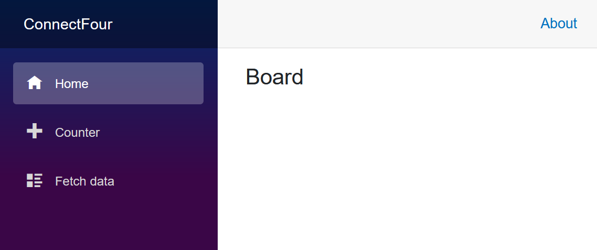
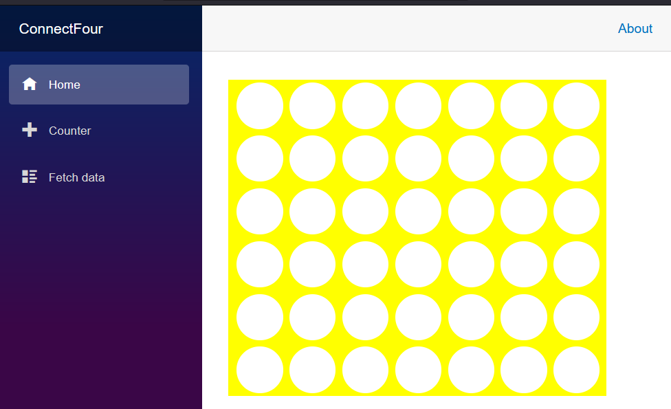
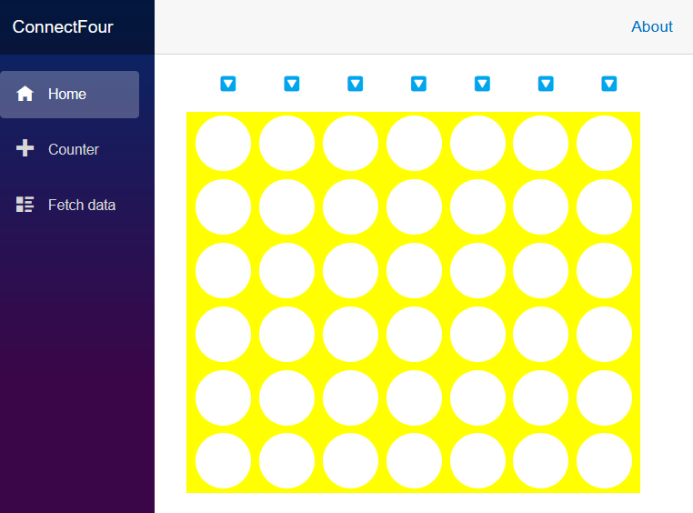
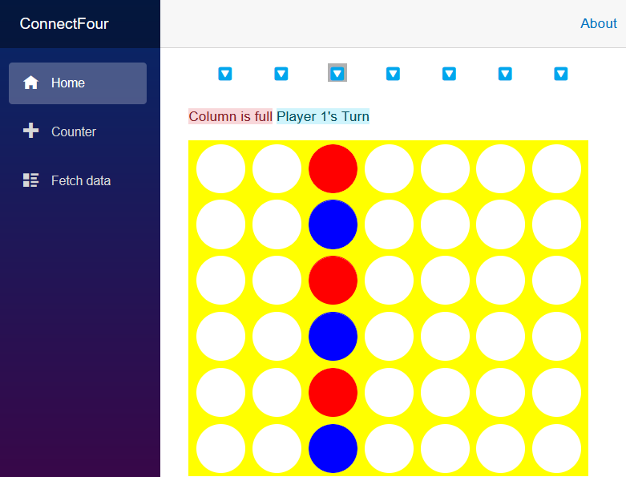
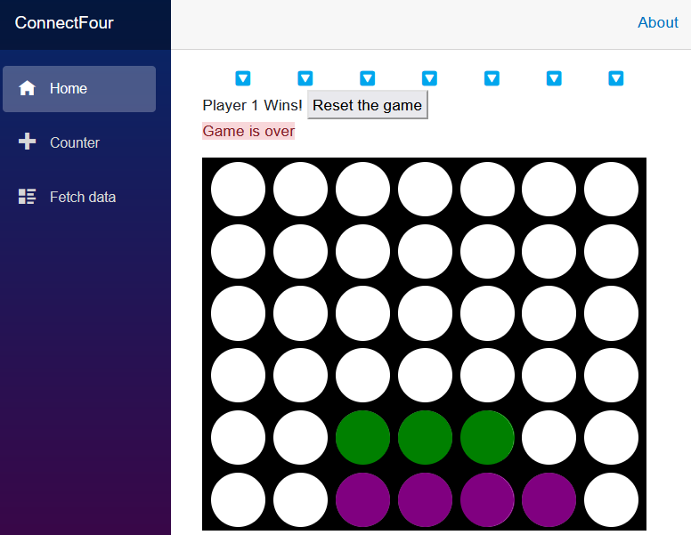

# Introducción a las Aplicaciones Web con Blazor

Hoy vamos a aprender a construir una aplicación con Blazor recreando el clásico juego de cuatro en línea, Conecta Cuatro.

## ¿Qué es Blazor?

Blazor es un marco de trabajo para construir páginas web con HTML, CSS y C#. Podemos definir el diseño y la apariencia del sitio web utilizando HTML y CSS estándar. Los componentes interactivos de las páginas web pueden entonces ser gestionados con código C# que se ejecuta en un servidor o en el navegador utilizando una tecnología estándar web llamada WebAssembly. Blazor nos permite definir nuestras páginas web y componentes utilizando la sintaxis Razor, una mezcla conveniente de HTML y C#. Puedes reutilizar fácilmente los componentes de Blazor dentro de otras páginas y componentes. Esta capacidad significa que podemos construir y reutilizar partes de nuestra aplicación fácilmente.

## ¿Qué es WebAssembly?

WebAssembly es una tecnología estándar disponible en todos los navegadores modernos que permite que el código se ejecute, de manera similar a JavaScript, en un navegador. Podemos usar herramientas para preparar nuestro código C# para su uso en el navegador como una aplicación WebAssembly, y estas herramientas están incluidas en el SDK de .NET.

## Estructura de este repositorio

Incluimos en este repositorio todo el diseño y la lógica del juego, así como una muestra completa de la aplicación Blazor Conecta Cuatro para comparar tu progreso. Vamos a guiarte a través de la construcción inicial de la aplicación usando la línea de comandos de .NET, y puedes encontrar una instancia de ese código con el CSS y la lógica del juego en la carpeta [0-inicio](src/0-inicio) de este repositorio. El estado completado del juego se puede encontrar en la carpeta [1-completado](src/1-completado).

## Lo que estamos construyendo

Este repositorio te guiará a través de Blazor e introducirá los siguientes conceptos:

- Fundamentos de componentes de Blazor
- Cómo empezar con la plantilla de proyecto de Aplicación Web Blazor
- Cómo construir y usar un diseño para un componente Blazor
- Cómo reaccionar a las interacciones de los usuarios

Logramos los objetivos anteriores escribiendo un clásico juego de cuatro en línea "Conecta Cuatro" que se ejecuta en tu navegador. En este juego, 2 jugadores se turnan para colocar una ficha (típicamente un disco) en la parte superior del tablero. Las fichas caen a la fila más baja de una columna y el jugador que coloca 4 fichas formando una línea horizontal, vertical o diagonalmente gana.

## Crear un nuevo proyecto Blazor

Primero, vamos a crear un nuevo proyecto para nuestro juego.

**Instrucciones de GitHub Codespaces**

1. Abre un GitHub Codespace. Para hacerlo, simplemente selecciona el botón verde **Code**. Luego, haz clic en el **+** para crear un Codespace en la rama principal.
2. Navega hasta los archivos del proyecto en la carpeta [0-inicio](src/0-inicio)

**Instrucciones de Visual Studio**

1. Crea una nueva aplicación Blazor en Visual Studio 2022 seleccionando el menú **Archivo > Nuevo > Proyecto**.

1. Elige "Aplicación web Blazor" de la lista de plantillas y nómbrala "ConnectFour". Selecciona **Siguiente**.

1. Elige .NET 8 como versión del marco. El tipo de autenticación debe estar configurado en **Ninguno**, el modo de representación interactiva debe estar configurado en **Servidor** y la ubicación de la interactividad debe estar configurada en **Por página/componente**. Deja todas las demás opciones como las predeterminadas.

    Esta acción debería crear un directorio "ConnectFour" que contiene nuestra aplicación.

1. Ejecuta la aplicación presionando <kbd>F5</kbd> en Visual Studio 2022.

    Ahora deberías ver la aplicación Blazor ejecutándose en tu navegador:

    

¡Felicidades! ¡Has creado tu primera aplicación Blazor!

## Crear un componente de tablero

A continuación, creemos un componente de tablero de juego que los jugadores utilizarán en nuestro juego. El componente se define utilizando la sintaxis Razor, que es una mezcla de HTML y C#.

1. Haz clic con el botón derecho en la carpeta *Components* en el Explorador de soluciones de Visual Studio. Elige **Agregar > Componente Razor** en el menú contextual y nombra el archivo *Tablero.razor*.

    Usaremos este componente para contener todo lo necesario para el diseño del tablero del juego y para gestionar las interacciones con él. El contenido inicial de este nuevo componente es una etiqueta `h3` y un bloque `@code` que indica dónde se debe escribir el código en C#:

    ```razor
    <h3>Tablero</h3>
    
    @code {
    
    }
    ```

1. Prepara la página `Home` abriendo el archivo *Components/Pages/Home.razor* y eliminando todo después de la tercera línea con la etiqueta `PageTitle`.

    ```razor
    @page "/"
    
    <PageTitle>Inicio</PageTitle>
    ```

1. Añade nuestro componente `Tablero` a la página `Home` agregando una etiqueta `<Tablero />`, que coincide con el nombre de archivo de nuestro nuevo componente.

    ```razor
    @page "/"
    
    <PageTitle>Índice</PageTitle>
    <Tablero />
    ```

    El archivo *Home.razor* es un componente al que se puede acceder desde un navegador web. Contiene HTML, C# y referencias a otros componentes de Blazor. Podemos identificar este archivo como una página debido a la presencia de la directiva `@page "/"` en la primera línea. Esta directiva asigna la ruta "/" al componente y le indica a Blazor que responda con el contenido de este archivo cuando se solicite la página predeterminada en la dirección "/" .

1. Ejecuta la aplicación con F5 para ver los cambios. Si la aplicación ya está en ejecución, pulsa el botón de Recarga en caliente (Hot Reload) junto al botón Ejecutar/Continuar para aplicar los cambios a la aplicación en ejecución.

    > CONSEJO: Selecciona la opción **Recargar en caliente al guardar el archivo** del menú Recarga en caliente para aplicar los cambios a la aplicación en ejecución cada vez que cambies un archivo.

    

¡Felicidades! ¡Has construido tu primer componente y lo has utilizado en una página Blazor.

## Añadiendo contenido y estilo al tablero de juego

Los componentes de Blazor contienen todo el HTML y el marcado necesario para ser renderizados en un navegador web. Empecemos por definir un tablero de juego con siete columnas y seis filas. Añadiremos un poco de estilo para dar vida a nuestro tablero.

1. En el archivo *Tablero.razor*, elimina el HTML en la parte superior y agrega el siguiente contenido para definir un tablero con 42 lugares para las piezas del juego.

   Podemos utilizar un bucle `for` en C# para generar las 42 posiciones del tablero. La etiqueta `span` del contenedor se toma y se repite con su contenido 42 veces para representar nuestro tablero.

   ```razor
   <div>
      <div class="board">
         @for (var i = 0; i < 42; i++)
         {
            <span class="container">
               <span></span>
            </span>
         }
      </div>
   </div>
   ```

Cuando guardamos el componente del tablero, nuestra aplicación se actualiza y aparece como una página vacía, gracias a la funcionalidad de Recarga en Caliente (Hot Reload) que reconstruye y lanza la aplicación actualizada.

> [!NOTA]
> Es posible que Visual Studio te pida reiniciar tu aplicación a medida que cambian los archivos. Confirma que la aplicación debe ser reconstruida cuando se edita el código, y la aplicación se reiniciará automáticamente y se actualizará el navegador a medida que añades características.

### Estilizando el componente

Añadamos algo de estilo al componente `Tablero` definiendo algunos colores para el marco del tablero y los jugadores arriba de la primera etiqueta `div` en el archivo *Tablero.razor*:

```razor
<HeadContent>
    <style>
        :root {
            --board-bg: yellow;  /** el color del tablero **/
            --jugador1: red;      /** color de las piezas del Jugador 1 **/
            --jugador2: blue;     /** color de las piezas del Jugador 2 **/
        }
    </style>
</HeadContent>

<div>...</div>
```

Estas variables CSS `--board-bg`, `--player1: red`, `--player2: blue` serán tomadas y utilizadas en el resto de nuestra hoja de estilo para este componente.

A continuación, agregaremos una hoja de estilo completada para el juego en el componente `Tablero`.

1. Haz clic derecho en el Explorador de Soluciones en la carpeta *Componentes* y crea un nuevo archivo CSS llamado *Tablero.razor.css*.

1. Copia el siguiente contenido en el nuevo archivo *Tablero.razor.css*:

```css
div{position:relative}nav{top:4em;width:30em;display:inline-flex;flex-direction:row;margin-left:10px}nav span{width:4em;text-align:center;cursor:pointer;font-size:1em}div.board{margin-top:1em;flex-wrap:wrap;width:30em;height:24em;overflow:hidden;display:inline-flex;flex-direction:row;flex-wrap:wrap;z-index:-5;row-gap:0;pointer-events:none;border-left:10px solid var(--board-bg)}span.container{width:4em;height:4em;margin:0;padding:4px;overflow:hidden;background-color:transparent;position:relative;z-index:-2;pointer-events:none}.container span{width:3.5em;height:3.5em;border-radius:50%;box-shadow:0 0 0 3em var(--board-bg);left:0;position:absolute;display:block;z-index:5;pointer-events:none}.player1,.player2{width:3.5em;height:3.5em;border-radius:50%;left:0;top:0;position:absolute;display:block;z-index:-8}.player1{background-color:var(--player1);animation-timing-function:cubic-bezier(.5,.05,1,.5);animation-iteration-count:1;animation-fill-mode:forwards;box-shadow:0 0 0 4px var(--player1)}.player2{background-color:var(--player2);animation-timing-function:cubic-bezier(.5,.05,1,.5);animation-iteration-count:1;animation-fill-mode:forwards;box-shadow:0 0 0 4px var(--player2)}.col0{left:calc(0em + 9px)}.col1{left:calc(4em + 9px)}.col2{left:calc(8em + 9px)}.col3{left:calc(12em + 9px)}.col4{left:calc(16em + 9px)}.col5{left:calc(20em + 9px)}.col6{left:calc(24em + 9px)}.drop1{animation-duration:1s;animation-name:drop1}.drop2{animation-duration:1.5s;animation-name:drop2}.drop3{animation-duration:1.6s;animation-name:drop3}.drop4{animation-duration:1.7s;animation-name:drop4}.drop5{animation-duration:1.8s;animation-name:drop5}.drop6{animation-duration:1.9s;animation-name:drop6}@keyframes drop1{100%,75%,90%,97%{transform:translateY(1.27em)}80%{transform:translateY(.4em)}95%{transform:translateY(.8em)}99%{transform:translateY(1em)}}@keyframes drop2{100%,75%,90%,97%{transform:translateY(5.27em)}80%{transform:translateY(3.8em)}95%{transform:translateY(4.6em)}99%{transform:translateY(4.9em)}}@keyframes drop3{100%,75%,90%,97%{transform:translateY(9.27em)}80%{transform:translateY(7.2em)}95%{transform:translateY(8.3em)}99%{transform:translateY(8.8em)}}@keyframes drop4{100%,75%,90%,97%{transform:translateY(13.27em)}80%{transform:translateY(10.6em)}95%{transform:translateY(12em)}99%{transform:translateY(12.7em)}}@keyframes drop5{100%,75%,90%,97%{transform:translateY(17.27em)}80%{transform:translateY(14em)}95%{transform:translateY(15.7em)}99%{transform:translateY(16.5em)}}@keyframes drop6{100%,75%,90%,97%{transform:translateY(21.27em)}80%{transform:translateY(17.4em)}95%{transform:translateY(19.4em)}99%{transform:translateY(20.4em)}}
```

Para mayor comodidad, también puedes encontrar este contenido en el archivo [0-inicio/Components/Tablero.razor.css](src/0-inicio/Components/Tablero.razor.css) en este repositorio.

Los componentes y páginas de Blazor tienen una característica llamada aislamiento de CSS que te permite crear reglas de estilo que solo se aplicarán al contenido de ese componente o página. Al crear un archivo con el mismo nombre que nuestro componente y agregar la extensión de archivo `.css`, Blazor reconocerá esto como los estilos que deben aplicarse **SÓLO** al contenido HTML en el componente `Tablero`.

Aquí tienes parte del CSS utilizado para dar formato al tablero y "perforar agujeros" para cada uno de los espacios. Hay más contenido disponible en el archivo CSS para las piezas del juego y sus animaciones en pantalla de lo que se muestra a continuación.

```css
    div.board {
        margin-top: 1em;
        flex-wrap: wrap;
        width: 30em;
        height: 24em;
        overflow: hidden;
        display: inline-flex;
        flex-direction: row;
        flex-wrap: wrap;
        z-index: -5;
        row-gap: 0;
        pointer-events: none;
        border-left: 10px solid var(--board-bg);
    }
    
    span.container {
        width: 4em;
        height: 4em;
        margin: 0;
        padding: 4px;
        overflow: hidden;
        background-color: transparent;
        position: relative;
        z-index: -2;
        pointer-events: none;
    }
    
    .container span {
        width: 3.5em;
        height: 3.5em;
        border-radius: 50%;
        box-shadow: 0 0 0 3em var(--board-bg);
        left: 0px;
        position: absolute;
        display: block;
        z-index: 5;
        pointer-events: none;
    }
```

El navegador debería actualizarse automáticamente (si no, puedes actualizarlo manualmente con F5), y deberías ser recibido con un tablero de Conecta Cuatro amarillo adecuado:



## Presentación de la lógica y controles del juego

La lógica del juego de Conecta Cuatro no es demasiado difícil de programar. Necesitamos algún código que administre el estado del juego y identifique 4 piezas de juego consecutivas jugadas una al lado de la otra y anuncie al ganador. Para ayudar a mantener este tutorial centrado en la enseñanza sobre Blazor, estamos proporcionando una clase llamada `EstadoJuego.cs` que contiene la lógica para gestionar el juego.

El [archivo EstadoJuego.cs está en este repositorio](src/1-completado/ConnectFour/EstadoJuego.cs) y lo copiarás en tu versión del juego.

1. Copia el [archivo EstadoJuego.cs](src/1-completado/ConnectFour/EstadoJuego.cs) de este repositorio en la raíz de tu proyecto.

Necesitamos hacer una instancia de `EstadoJuego` disponible para cualquier componente que la solicite, y solo una instancia de `EstadoJuego` debe estar disponible en nuestra aplicación a la vez. Abordaremos esta necesidad registrando nuestro `EstadoJuego` como un servicio singleton en la aplicación.

1. Abre el archivo *Program.cs* en la raíz del proyecto y agrega esta declaración para configurar `EstadoJuego` como un servicio singleton en tu aplicación:

    ```csharp
    builder.Services.AddSingleton<EstadoJuego>();
    ```

    Ahora podemos inyectar una instancia de la clase `EstadoJuego` en nuestro componente `Tablero`.

1. Agrega la siguiente directiva `@inject` en la parte superior del archivo *Tablero.razor* para inyectar el estado actual del juego en el componente:

    ```razor
    @inject EstadoJuego Estado
    ```

    Ahora podemos empezar a conectar nuestro componente `Tablero` con el estado del juego.

## Restablecer el estado

Comencemos por restablecer el estado del juego cuando el componente `Tablero` se pinte por primera vez en la pantalla. Agregaremos un código para restablecer el estado del juego cuando se inicialice el componente.

1. Agrega un método `OnInitialized` con una llamada a `ReiniciarTablero`, dentro del bloque `@code` en la parte inferior del archivo *Tablero.razor*, de la siguiente manera:

    ```razor
    @code {
        protected override void OnInitialized()
        {
            Estado.ReiniciarTablero();
        }
    }
    ```

    Cuando el tablero se muestra por primera vez a un usuario, el estado se restablece al comienzo del juego.

## Crear las piezas del juego

A continuación, asignemos las posibles 42 piezas de juego que podrían jugarse. Podemos representar las piezas del juego como un conjunto de 42 elementos HTML en el tablero. Podemos mover y colocar esas piezas asignando un conjunto de clases CSS con posiciones de columna y fila.

1. Define un campo de matriz de cadenas en el bloque de código para mantener nuestras piezas de juego:

    ```razor
    private string[] pieces = new string[42];
    ```

1. Agrega código a la sección HTML que crea 42 etiquetas `span`, una para cada pieza de juego, en el mismo componente:

    ```razor
    @for (var i = 0; i < 42; i++)
    {
       <span class="@pieces[i]"></span>
    }
    ```

    Tu código completo debería lucir así:

    ```razor
    <div>
        <div class="board">...</div>
        @for (var i = 0; i < 42; i++)
        {
           <span class="@pieces[i]"></span>
        }
    </div>
    @code {
        private string[] Pieces = new string[42];
    
        protected override void OnInitialized()
        {
            Estado.ReiniciarTablero();
        }
    }
    ```

    Esto asigna una cadena vacía a la clase CSS de cada etiqueta de pieza de juego. Una cadena vacía para una clase CSS evita que las piezas de juego aparezcan en la pantalla, ya que no se les aplica ningún estilo.

## Manejar la colocación de las piezas del juego

Agreguemos un método para manejar cuando un jugador coloca una pieza en una columna. La clase `EstadoJuego` sabe cómo asignar la fila correcta para la pieza del juego y reporta la fila en la que aterrizó. Podemos usar esta información para asignar clases CSS que representen el color del jugador, la ubicación final de la pieza y una animación CSS de caída.

Llamaremos a este método `JugarPieza` y acepta un parámetro de entrada que especifica la columna que el jugador ha elegido.

1. Agrega este código debajo de la matriz `pieces` que definimos en el paso anterior.

    ```csharp
    private void JugarPieza(byte col)
    {
        var player = Estado.TurnoJugador;
        var turn = Estado.CurrentTurn;
        var landingRow = Estado.JugarPieza(col);
        pieces[turn] = $"player{player} col{col} drop{landingRow}";
    }
    ```

Esto es lo que hace el código de `JugarPieza`:

1. Le decimos al estado del juego que juegue una pieza en la columna enviada llamada `col` y capturamos la fila en la que aterrizó la pieza.
1. Luego podemos definir las tres clases CSS para asignar a la pieza del juego para identificar qué jugador está actuando actualmente, la columna en la que se colocó la pieza y la fila de aterrizaje.
1. La última línea del método asigna estas clases a esa pieza del juego en la matriz `pieces`.

Si miras en el archivo *Tablero.razor.css* suministrado, encontrarás las clases CSS que coinciden con la columna, la fila y el turno del jugador.

El efecto resultante es que la pieza del juego se coloca en la columna y se anima para caer en la fila más baja cuando se llama a este método.

## Elección de una columna

A continuación, necesitamos colocar algunos controles que permitan a los jugadores elegir una columna y llamar a nuestro nuevo método `JugarPieza`. Usaremos el carácter "🔽" para indicar que puedes soltar una pieza en esta columna.

1. Encima de la etiqueta `<div>` de inicio, agrega una fila de botones clicables:

    ```html
    <nav>
        @for (byte i = 0; i < 7; i++)
        {
            var piece = i;
            <span title="Haga clic para jugar una pieza" @onclick="() => JugarPieza(piece)">🔽</span>
        }
    </nav>
    ```

    El atributo `@onclick` especifica un controlador de eventos para el evento de clic. Pero para manejar eventos de interfaz de usuario, un componente Blazor debe renderizarse utilizando un *modo de representación interactivo*. Por defecto, los componentes Blazor se representan estáticamente desde el servidor. Podemos aplicar un modo de representación interactivo a un componente utilizando el atributo `@rendermode`.

1. Actualiza el componente `Tablero` en la página `Home` para que use el modo de representación `InteractiveServer`.

    ```razor
    <Tablero @rendermode="InteractiveServer" />
    ```

    El modo de representación `InteractiveServer` manejará los eventos de interfaz de usuario para tus componentes desde el servidor a través de una conexión WebSocket con el navegador.

1. Ejecuta la aplicación con estos cambios. Debería lucir así ahora:

    

    ¡Aún mejor, cuando seleccionamos uno de los botones de soltar en la parte superior, se puede observar el siguiente comportamiento:

    

¡Gran progreso! Ahora podemos agregar piezas al tablero. El objeto `EstadoJuego` es lo suficientemente inteligente como para alternar entre los dos jugadores. Adelante, selecciona más botones de soltar y observa los resultados.

## Ganar y manejo de errores

Si juegas con el juego que has configurado en este punto, te darás cuenta de que genera errores cuando intentas colocar demasiadas piezas en la misma columna y cuando un jugador ha ganado el juego.

Agreguemos manejo de errores e indicadores en nuestro tablero para hacer que el estado actual sea claro. Agregaremos un área de estado encima del tablero y debajo de los botones de soltar.

1. Inserta el siguiente marcado después del elemento `nav`:

    ```razor
    <nav>...</nav>
    
    <article>
        @winnerMessage  <button style="@ResetStyle" @onclick="ResetGame">Reiniciar el juego</button>
        <br />
        <span class="alert-danger">@errorMessage</span>
        <span class="alert-info">@CurrentTurn</span>
    </article>
    ```

    Este marcado nos permite mostrar indicadores para:

    - Anunciar un ganador del juego.
    - Un botón que nos permite reiniciar el juego.
    - Mensajes de error.
    - El turno del jugador actual.

    Llenemos con lógica para establecer estos valores.

1. Agrega el siguiente código después de la matriz `pieces`:

    ```csharp
    private string[] pieces = new string[42];
    private string winnerMessage = string.Empty;
    private string errorMessage = string.Empty;
    
    private string CurrentTurn => (winnerMessage == string.Empty) ? $"Turno del Jugador {Estado.TurnoJugador}" : "";
    private string ResetStyle => (winnerMessage == string.Empty) ? "display: none;" : "";
    ```

    - La propiedad `CurrentTurn` se calcula automáticamente en función del estado de `winnerMessage` y la propiedad `TurnoJugador` de `EstadoJuego`.
    - `ResetStyle` se calcula en función del contenido de `winnerMessage`. Si hay un `winnerMessage`, hacemos que el botón de reinicio aparezca en la pantalla.

1. Manos la gestión del mensaje de error cuando se juega una pieza. Agrega una línea para borrar el mensaje de error y luego envuelve el código en el método `JugarPieza` con un bloque `try...catch` para establecer `errorMessage` si se produce una excepción:

    ```csharp
    errorMessage = string.Empty;
    try
    {
        var player = Estado.TurnoJugador;
        var turn = Estado.CurrentTurn;
        var landingRow = Estado.JugarPieza(col);
        pieces[turn] = $"player{player} col{col} drop{landingRow}";
    }
    catch (ArgumentException ex)
    {
        errorMessage = ex.Message;
    }
    ```

    Nuestro indicador de manejo de errores es simple y utiliza el framework de CSS Bootstrap para mostrar un error en modo peligroso.

    

1. A continuación, agreguemos el método `ReiniciarJuego` que nuestro botón activa para reiniciar un juego. Actualmente, la única forma de reiniciar un juego es actualizar la página. Este código nos permite permanecer en la misma página.

    ```csharp
    void ReiniciarJuego()
    {
        Estado.ReiniciarTablero();
        winnerMessage = string.Empty;
        errorMessage = string.Empty;
        pieces = new string[42];
    }
    ```

    Ahora nuestro método `ReiniciarJuego` tiene la siguiente lógica:

    - Restablece el estado del tablero.
    - Oculta nuestros indicadores.
    - Restablece la matriz de piezas a una matriz vacía de 42 cadenas.

    Esta actualización debería permitirnos jugar el juego nuevamente, y ahora vemos un indicador justo encima del tablero que declara el turno del jugador y eventualmente la finalización del juego.

    

    Todavía estamos en una situación en la que no podemos seleccionar el botón de reinicio. Añadamos alguna lógica en el método `JugarPieza` para detectar el final del juego.

1. Detectemos si hay un ganador en el juego agregando una expresión `switch` después de nuestro bloque `try...catch` en `JugarPieza`.

    ```csharp
    winnerMessage = Estado.CheckForWin() switch
    {
        EstadoJuego.WinState.Player1_Wins => "¡El Jugador 1 Gana!",
        EstadoJuego.WinState.Player2_Wins => "¡El Jugador 2 Gana!",
        EstadoJuego.WinState.Empate => "¡Es un empate!",
        _ => ""
    };
    ```

    El método `CheckForWin` devuelve un enum que informa qué jugador, si alguno, ha ganado el juego o si el juego es un empate. Esta expresión `switch` establecerá el campo `winnerMessage` apropiadamente si se ha producido un estado de final de juego.

    Ahora, cuando jugamos y llegamos a un escenario de final de juego, aparecen estos indicadores:

    

## Personalizando el tablero con parámetros

El juego funciona, pero tal vez no te gusten nuestros colores predeterminados. En Blazor, podemos definir parámetros en nuestros componentes que nos permiten pasar valores que se ven como atributos en una etiqueta HTML.

Agreguemos algunos parámetros para los colores en el tablero y pasemos algunos colores geniales desde la página `Home`.

Los parámetros en Blazor son propiedades en un componente que han sido decoradas con el atributo `Parameter`.

1. En *Tablero.razor*, definamos tres propiedades para el color del tablero y los colores de cada jugador. Antes del método `OnInitialized`, agrega estas líneas de código:

    ```csharp
    [Parameter]
    public Color BoardColor { get; set; } = ColorTranslator.FromHtml("yellow");
    
    [Parameter]
    public Color Player1Color { get; set; } = ColorTranslator.FromHtml("red");
    
    [Parameter]
    public Color Player2Color { get; set; } = ColorTranslator.FromHtml("blue");
    ```

    Usamos el tipo `Color` para asegurarnos de que los valores pasados a nuestro componente Tablero sean realmente colores.

1. Agrega una directiva `@using` en la parte superior del archivo *Tablero.razor* para indicar que estamos utilizando contenido del espacio de nombres `System.Drawing`.

    ```razor
    @using System.Drawing
    ```

1. Usa los parámetros en el bloque CSS en la parte superior de *Tablero.razor* para establecer los valores de las variables CSS.

    ```razor
    <HeadContent>
        <style>
            :root {
                --board-bg: @ColorTranslator.ToHtml(BoardColor);
                --player1: @ColorTranslator.ToHtml(Player1Color);
                --player2: @ColorTranslator.ToHtml(Player2Color);
            }
        </style>
    </HeadContent>
    ```

    Este cambio no debería haber cambiado nada en la apariencia de nuestro tablero de juego.

1. Volvamos a *Home.razor* y agreguemos algunos parámetros a nuestra etiqueta `Tablero` y veamos cómo cambian el juego.

    ```razor
    <Tablero @rendermode="InteractiveServer"
         BoardColor="System.Drawing.Color.Black"
         Player1Color="System.Drawing.Color.Green"
         Player2Color="System.Drawing.Color.Purple" />
    ```

    ¿No es un tablero genial?

    

## Resumen

Hemos aprendido mucho sobre Blazor y hemos construido un pequeño juego interesante. Aquí hay algunas de las habilidades que hemos aprendido:

- Creamos un componente.
- Agregamos ese componente a nuestra página de inicio.
- Usamos la inyección de dependencias para gestionar el estado de un juego.
- Hicimos el juego interactivo con controladores de eventos para colocar piezas y reiniciar el juego.
- Escribimos un manejador de errores para informar el estado del juego.
- Agregamos parámetros a nuestro componente.

Este es solo un juego simple, y hay mucho más que podrías hacer con él. ¿Buscas algunos desafíos para mejorarlo? Considera los siguientes desafíos:

- Elimina el diseño predeterminado y las páginas adicionales en la aplicación para hacerla más pequeña.
- Mejora los parámetros del componente `Tablero` para que puedas pasar cualquier valor válido de color CSS.
- Mejora la apariencia de los indicadores con algo de CSS y diseño HTML.
- Introduce efectos de sonido.
- Agrega un indicador visual y evita que se utilice un botón de soltar cuando la columna esté llena.
- Agrega capacidades de redes para que puedas jugar con un amigo en su navegador.
- Inserta el juego en una aplicación .NET MAUI con Blazor y juega en tu teléfono o tableta.

¡Feliz codificación y diviértete!

## Conéctate con nosotros

¡Estamos emocionados de apoyarte en tu viaje de aprendizaje! Consulta la [Página de Comunidad de .NET](https://dotnet.microsoft.com/platform/community) para encontrar enlaces a nuestros blogs, YouTube, Twitter y más.

## ¿Cómo fue?

Por favor, realiza esta rápida [encuesta de 10 preguntas](https://aka.ms/WebLearningSeries-git-survey) para darnos tus opiniones sobre esta lección y el desafío.
